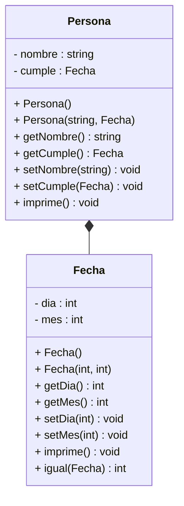

# Ejercicio-Autograding para C++ usando Catch2

**Fuente:** *Learning Autograding with C/C++ and Catch2 - Prof. Igor Machado Coelho* 
https://medium.com/swlh/easy-c-autograding-on-github-classroom-with-catch2-106ad1107402

## Descripción del Problema

Ve siguiendo paso a paso las instrucciones de este examen.

## Diagrama de Clases

**(54 puntos)** Implementa en C++ las clases mostradas en el diagrama UML de abajo. Revisa más abajo, algunos requerimientos que deberás considerar en la implementación. Empieza por la clase Fecha.

## Especificaciones
Las dos clases deben tener la definición en un **archivo hpp** y las implementaciones en un **archivo cpp**.

**CLASE FECHA** 

Representa la fecha de cumpleaños de una persona, los atributos son enteros, el mes debe estar entre 1 y 12 para ser válido y e día debe estar entre 1 y 31 para ser válido. Por lo que deberás validar que, si te pasan dias o meses fuera de rango, para construir o modificar el objeto, el día o mes quedan en 1. TIP: valida en los setters y usa los setters en el constructor **(ya tienes el constructor con parámetros, no lo modifiques)**.
1. Implementa el constructor default Este constructor inicializa todos los atributos en 1.
2. Implementa los getters de todos los atributos.
3. Implementa los setters de todos los atributos, en los setters deberás hacer la validación, si el valor recibido como parámetro es inválido, se asina 1 de lo contrario asignas el valor recibido como parámetro.
4. El método **imprime()** despliega a pantalla todos los atributos del objeto, utiliza el formato que tú quieras para esto (dale personalidad a tu imprime).
5. El método **iguales(Fecha)**, devuelve un entero 1 si “ésta” Fecha es igual a la que recibe como parámetro. Decimos que son iguales, si coinciden en mes y día, si no coinciden regresa un 0.

**CLASE CAJA** 

Representa una persona con nombre y fecha de cumpleaños
1. Observa que el atributo cumple es un objeto de la clase Fecha.
2. Codifica los dos constructores (por defecto y con parámetros), así como getters y setters para todos los atributos. El nombre por defecto es amigo y la fecha es la default.
3. El método imprime() imprime todos los datos de la Persona. Utiliza el formato que tú quieras para esto (dale personalidad a tu imprime) y recuerda que tienes un método en Fecha que imprime en el formato que tu diseñaste.

**(16 puntos en total)** En el programa principal **exercise.cpp** prueba tus clases de la siguiente manera: 

* En la función main() tienes declarada una constante llamada NUM que te servirá para determinar el tamaño de un arreglo.
* **(1 punto)** En la función main(), declara un arreglo de tipo Personas de tamaño NUM.
* **(3 puntos)** Completa la función **llenaArreglo**, la cual sirve para “cambiar todos los datos de los objetos” del arreglo con datos que recibe del usuario. No olvides que el atributo cumple de la Persona es un objeto de la clase Fecha.
* **(3 puntos)** Implementa la función imprimeAmigos para desplegar a pantalla TODOS los objetos Persona del arreglo.
* **(2 puntos)** En la función main(), después de crear el arreglo, llama a la función **llenaArreglo** con el arreglo recién creado y la constante que tiene el tamaño del arreglo.
* **(2 puntos)** Posteriormente llama a la función **imprimeAmigos** para que se desplieguen a pantalla los datos de las Personas.
* **(2 puntos)** Escribe las instrucciones necesarias para imprimir a pantalla la fecha de cumpleaños de la última Persona del arreglo. 
* **(3 puntos)** Escribe las instrucciones necesarias para determinar con un mensaje si la primera Persona del arreglo y la última Persona del arreglo tienen la misma fecha de cumpleaños (usa el método de la clase Fecha adecuado)

**NOTA:** Son 10 pruebas con 20 asserts que revisa el autograder y que debes pasar para obtener los puntos de la implementación de las clases. Lo del programa principal lo califico de manera manual.

## Objetivo

- Busca que el código pase correctamente todas las pruebas
   * Solamente cambia los archivos permitidos para lograr este objetivo (abajo se indican las reglas específicas)
   
- Las GitHub Actions deberán presentar una palomita en verde si se han satisfecho todas las pruebas, y una cruz roja cuando alguna (o todas) las pruebas han fallado.
   * **Recomendación:** Puedes dar clic en la cruz roja para verificar cual de las pruebas ha fallado (o si el código no ha compilado correctamente).
   * **Recomendación:** En caso de que el Autograding no muestre pruebas o no funcione, contacta a tu profesor mediante un issue.

## Instrucciones

- Deberás modificar todos los archivos necesarios tal cual te lo marca el archivo del examen.
- Ya no necesitas crear más archivo, sólo implementar lo que se te indique.

Explicación de los otros archivos:
- Archivo `test/tests.cpp` tiene las pruebas de esta actividad (NO LO CAMBIES!)
- Archivo `test/catch.hpp` tiene la biblioteca de pruebas  CATCH2 (NO LA CAMBIES!)
- Archivo `makefile` tienes los comandos para ejecutar la actividad (NO LO CAMBIES!)
- Archivo  `./build/appTests` se generará después de compilar (para **pruebas locales**, solo ejecútalo)

## Comandos para pruebas locales, ejecución y depuración

- Comando para construir y ejecutar pruebas: `make` o `make test`
    * Si el ejecutable ya está construido, sólo teclea : `./build/appTests`

- Comando para construir y ejecutar la aplicación: `make run` 
    * Si el ejecutable ya está construido, sólo teclea : `./build/exercise`

- Comando para depurar: `make debug`
    * Para conocer los comandos de depuración consulta:
     https://u.osu.edu/cstutorials/2018/09/28/how-to-debug-c-program-using-gdb-in-6-simple-steps/
     
- Comando para depurar programa principal : `make debugvs` 
    * Utilizar el depurador de la IDE.     

- Comando para depurar pruebas : `make debugtest` 
    * Utilizar el depurador de la IDE.     

## Notas

- El código será evaluado solamente si compila.
   * La razón de esto es, si no compila no es posible generar el ejecutable y realizar las pruebas.

- Algunos casos de prueba podrían recibir calificación individual, otros podrían recibir calificación y si pasan todos juntos (o todas las pruebas en conjunto).

- La calificación final se otorgará de manera automática en cada *commit + push*, y se evaluará solamente hasta la fecha limite de la actividad.

Para dudas adicionales, consulta a tu profesor.

## License

MIT License 2020
